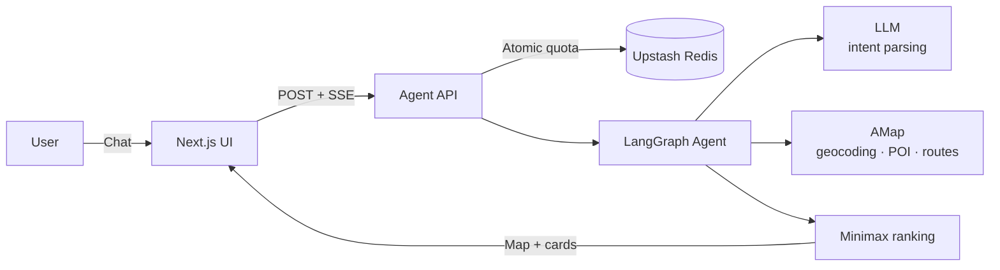

<div align="center">

# Centro

### An AI Agent for fair meetup planning

**Not another midpoint calculator. Centro finds a place that fits the plan without making one person carry most of the journey.**

Describe where everyone starts and what the group wants. Centro compares real routes, ranks nearby venues by travel fairness, and explains the result on a map.


**[🚀 Live Demo](https://centro-nine.vercel.app/)** · **[📖 中文文档](./README.zh-CN.md)** · **[⚙️ Quick Start](#quick-start)**

</div>

---

## Why Centro

- **A geographic midpoint is not necessarily fair.** Rivers, road networks, metro transfers, and congestion turn similar distances into very different journeys.
- **Travel fairness and venue preference must be solved together.** A convenient area is useless if it does not contain what the group wants.
- **Average time can hide one terrible trip.** Centro ranks venues by the slowest participant's route and keeps every route visible.

## How it works

Start with one conversational request:

```text
我住深圳坪山，小明住深圳坪洲，想吃烧烤
```

Then refine it without rebuilding the request:

```text
换成水煮肉          → reuse participants and the current center
我地址改到深圳南山  → clear stale locations and recompute the plan
```

The Agent extracts participants, addresses, city, and venue preference; asks for missing details; searches around a shared area; plans every participant-to-venue route; and streams ranked results back to the map.

| Capability | Behavior |
|---|---|
| Natural-language planning | Parses conversational Chinese into structured meetup constraints |
| Stateful refinement | Reuses valid location state and recomputes it when an address or city changes |
| Real route comparison | Uses AMap geocoding, POI search, and transit/driving routes |
| Fairness-first ranking | Minimizes the slowest participant's arrival time |
| Explainable results | Shows the center, ranked venues, distance, duration, and travel mode |
| Streaming progress | Sends geocoding, search, route, and ranking states through SSE |
| Responsive UI | Supports conversation and map/result views on mobile |
| No-API preset | Loads a deterministic sample scenario without calling external services |

## Architecture



- **LangGraph Agent** — separates new requests, missing-information clarification, preference-only updates, and address/city changes.
- **AMap Web Service** — provides geocoding, nearby venue discovery, and route planning.
- **Upstash Redis** — atomically enforces shared limits before LLM or map calls begin.
- **Next.js + SSE** — validates requests and streams Agent progress to the responsive interface.

## Fairness model

For each candidate venue:

```text
fairness score = max(route time for every participant)
```

The smallest maximum arrival time ranks first. Candidates without a complete route for every participant are excluded instead of receiving fabricated fallback values.

## Tech stack

| Layer | Technology |
|---|---|
| Interface | Next.js 15 · React 19 · TypeScript · Tailwind CSS · Leaflet |
| Agent | LangGraph.js · DeepSeek through an OpenAI-compatible API |
| Location | AMap Web Service |
| API and quotas | Next.js Route Handler · SSE · Upstash Redis |
| Deployment | Vercel |

## Quick Start

**Requirements:** Node.js 20+, an OpenAI-compatible LLM key, and an AMap Web Service key.

1. Fork the repository, then clone your fork:

```bash
git clone https://github.com/<your-account>/centro.git
cd centro
npm install
cp .env.local.example .env.local
```

2. Configure `.env.local`:

```dotenv
LLM_API_KEY=your_llm_api_key
LLM_BASE_URL=https://api.deepseek.com/v1
LLM_MODEL=deepseek-chat

AMAP_API_KEY=your_amap_web_service_key

UPSTASH_REDIS_REST_URL=your_upstash_rest_url
UPSTASH_REDIS_REST_TOKEN=your_upstash_rest_token

DEMO_RATE_LIMIT_ENABLED=true
DEMO_DAILY_PER_IP=5
DEMO_DAILY_GLOBAL=30
DEMO_BURST_PER_IP=3
DEMO_BURST_WINDOW_SECONDS=600
```

3. Start locally:

```bash
npm run dev
```

Open <http://localhost:3000>. The sample preset works without credentials; custom search requires the LLM and AMap keys. Redis is required when shared Demo limits are enabled.

4. Verify a fork before deployment:

```bash
npm test
npm run build
```

## Project Structure

```text
app/
├── api/agent/route.ts       request validation + SSE endpoint
└── components/              chat, map, and recommendation UI
lib/
├── agent/graph.ts           LangGraph state machine + fairness ranking
├── agent/limits.ts          participant and candidate boundaries
├── demo/                    validation, Redis quotas, and sample preset
└── tools/amap.ts            geocoding, POI, and route adapters
tests/                       Agent, quota, API, route, and mobile regressions
```

## Deployment

1. Import your fork into Vercel.
2. Add the LLM and AMap variables from `.env.local` to Project Settings → Environment Variables.
3. Connect Upstash Redis from Vercel Marketplace. Centro accepts both canonical Upstash names and the prefixed names generated by the integration.
4. Keep real keys in local or provider-managed environment variables—never commit them to Git.
5. Deploy `main`.

The default public limits allow 5 live requests per client per Beijing day, 30 across the deployment per day, and 3 per client in a 10-minute window. Redis checks all counters atomically before external API calls. If live services are unavailable, the no-API preset remains usable.

## Supported scope and limitations

- Reliable for same-city meetup planning across different neighborhoods or districts; full addresses that include the city work best.
- Search and routing are bounded for API cost control and are not an exhaustive venue crawl.
- Venue availability, reservations, dietary constraints, opening hours, and live congestion are not modeled.
- Long-distance labels are guidance only; railway timetables, station transfers, and true inter-city multimodal routing are not implemented.
- Live location text is sent to the configured LLM and map providers.

## Roadmap

- Timetable-aware inter-city and multimodal meetup planning
- Weighted cost, rating, cuisine, and accessibility preferences
- Arrival-time windows and opening-hours checks
- Shareable plans, participant voting, and authenticated usage tiers

## License

[MIT](./LICENSE)
