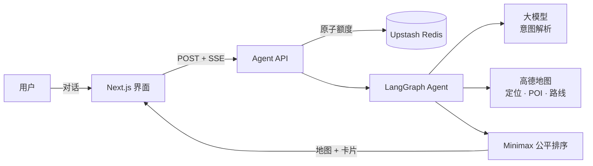

<div align="center">

# Centro

### AI 多人公平聚会选址 Agent

**不是简单找一个地理中点，而是找到一个符合聚会偏好、又不让某个人承担大部分路程的见面地点。**

用自然语言告诉 Centro 每个人从哪里出发、大家想吃什么或做什么。它会比较真实路线，按出行公平性排序候选场所，并在地图上解释结果。


**[🚀 在线 Demo](https://centro-nine.vercel.app/)** · **[📖 English](./README.md)** · **[⚙️ 快速开始](#快速开始)**

</div>

---

## 为什么做 Centro

- **地理中点不等于公平地点。** 河流、道路、地铁换乘和拥堵，会让相似的直线距离变成完全不同的通勤时间。
- **出行公平和场所偏好必须一起考虑。** 位置方便，但没有大家想吃的餐厅或想去的场所，结果依然无效。
- **平均时间可能掩盖一个人的糟糕体验。** Centro 按最慢到达者的路线排序，同时保留每个人的路线明细。

## 工作方式

用一句话开始规划：

```text
我住深圳坪山，小明住深圳坪洲，想吃烧烤
```

接下来可以直接修改需求：

```text
换成水煮肉          → 复用参与者和当前中心位置
我地址改到深圳南山  → 清除过期位置并重新计算方案
```

Agent 会提取参与者、地址、城市和场所偏好；在信息不足时继续追问；围绕共享区域搜索候选地点；规划每个人到每个候选点的路线；最后把排序结果流式返回地图。

| 能力 | 实际行为 |
|---|---|
| 自然语言规划 | 从中文对话中提取结构化聚会条件 |
| 有状态需求修改 | 复用仍然有效的位置，地址或城市变化时重新计算 |
| 真实路线比较 | 使用高德地理编码、POI 搜索和公交/驾车路线 |
| 公平性优先排序 | 优先降低最慢参与者的到达时间 |
| 可解释结果 | 展示中心区域、候选场所、距离、时间和交通方式 |
| 流式进度 | 通过 SSE 返回定位、搜索、路线规划和排序状态 |
| 响应式界面 | 移动端支持对话与地图结果视图 |
| 无 API 示例 | 不调用外部服务即可载入确定性的完整示例 |

## 架构



- **LangGraph Agent**：区分全新需求、信息补充、只换场所偏好，以及地址/城市变化。
- **高德地图 Web 服务**：提供地理编码、周边场所搜索和路线规划。
- **Upstash Redis**：在大模型或地图调用开始前，原子执行共享额度检查。
- **Next.js + SSE**：校验请求，并把 Agent 执行进度流式返回响应式界面。

## 公平性模型

对每一个候选地点计算：

```text
公平性分数 = 所有参与者路线时间的最大值
```

最大到达时间越小，排名越靠前。缺少任意一位参与者完整路线的候选点会被排除，不会使用伪造的兜底数值参与排序。

## 技术栈

| 层级 | 技术 |
|---|---|
| 交互界面 | Next.js 15 · React 19 · TypeScript · Tailwind CSS · Leaflet |
| Agent | LangGraph.js · DeepSeek OpenAI-compatible API |
| 地图服务 | 高德地图 Web 服务 |
| API 与额度 | Next.js Route Handler · SSE · Upstash Redis |
| 部署 | Vercel |

## 快速开始

**前置条件：** Node.js 20+、OpenAI-compatible 大模型 Key，以及高德地图 Web 服务 Key。

1. Fork 仓库，然后克隆自己的 Fork：

```bash
git clone https://github.com/<your-account>/centro.git
cd centro
npm install
cp .env.local.example .env.local
```

2. 配置 `.env.local`：

```dotenv
LLM_API_KEY=your_llm_api_key
LLM_BASE_URL=https://api.deepseek.com/v1
LLM_MODEL=deepseek-chat

AMAP_API_KEY=your_amap_web_service_key

UPSTASH_REDIS_REST_URL=your_upstash_rest_url
UPSTASH_REDIS_REST_TOKEN=your_upstash_rest_token

DEMO_RATE_LIMIT_ENABLED=true
DEMO_DAILY_PER_IP=5
DEMO_DAILY_GLOBAL=30
DEMO_BURST_PER_IP=3
DEMO_BURST_WINDOW_SECONDS=600
```

3. 本地运行：

```bash
npm run dev
```

打开 <http://localhost:3000>。示例场景不需要凭证；自定义搜索需要大模型和高德 Key。启用共享 Demo 额度时需要 Redis。

4. 部署前验证 Fork：

```bash
npm test
npm run build
```

## 项目结构

```text
app/
├── api/agent/route.ts       请求校验 + SSE 接口
└── components/              对话、地图和推荐界面
lib/
├── agent/graph.ts           LangGraph 状态机 + 公平排序
├── agent/limits.ts          参与者和候选地点边界
├── demo/                    校验、Redis 额度和示例场景
└── tools/amap.ts            地理编码、POI 和路线适配器
tests/                       Agent、额度、API、路线和移动端回归测试
```

## 部署

1. 把自己的 Fork 导入 Vercel。
2. 在 Project Settings → Environment Variables 配置 `.env.local` 中的大模型和高德变量。
3. 从 Vercel Marketplace 连接 Upstash Redis。Centro 同时兼容标准变量名和集成自动生成的带前缀变量名。
4. 真实 Key 只能保存在本地或部署平台管理的环境变量中，不能提交到 Git。
5. 部署 `main` 分支。

默认公共额度为：每个客户端每个北京时间自然日 5 次、全站每天 30 次、每个客户端在 10 分钟内 3 次。Redis 会在外部 API 调用前原子检查全部计数器。实时服务不可用时，无 API 示例仍可使用。

## 支持范围与限制

- 可靠支持同城不同街区、不同城区的聚会选址；包含城市名的完整地址效果更稳定。
- 为控制 API 成本，搜索和路线规划有数量边界，不是穷举式场所抓取。
- 暂未处理预约余位、饮食禁忌、营业时间和实时拥堵。
- 长距离交通标签仅作为提示；尚未接入铁路时刻表、车站换乘和完整跨城多式联运。
- 实时搜索会把位置文本发送给已配置的大模型和地图服务。

## Roadmap

- 基于时刻表的跨城与多式联运聚会规划
- 费用、评分、菜系和无障碍条件权重
- 到达时间窗口与营业时间检查
- 可分享方案、多人投票和登录用户分级额度

## License

[MIT](./LICENSE)
