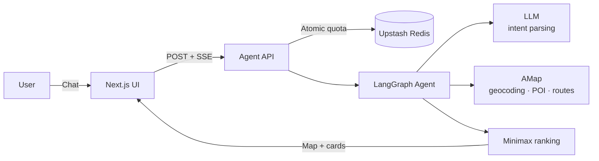

# Centro Product README Simplification Design

**Date:** 2026-08-10  
**Scope:** `README.md` and `README.zh-CN.md`

## Objective

Rewrite both READMEs as documentation for a real open-source product that exists to solve meetup coordination. Readers should infer the engineering quality from the product behavior, architecture, setup instructions, and operational safeguards—not from text that calls Centro a portfolio or discusses recruiters, interviewers, visitors, or demonstrations of ability.

The information density should resemble the public [VibePop](https://github.com/xinKyy/vibe-pop) README: concise product value, scannable features, one architecture diagram, reproducible setup, deployment guidance, project structure, limitations, and roadmap.

## Narrative Rules

- Explain the user problem, the product behavior, and how to run or extend the system.
- Remove all external-facing references to “portfolio,” “interviewer,” “recruiter,” “visitor,” or “showcase.”
- Keep “Live Demo” and “Demo rate limits”; these are ordinary operational product terms.
- Do not explain that a feature exists to impress a reviewer.
- Do not exaggerate inter-city support or other incomplete capabilities.
- Keep English and Chinese structurally aligned but idiomatic rather than literal translations.

## Selected Approach

Use a balanced open-source product README, shortened by roughly 30%–40% from the current version.

Rejected alternatives:

1. **Landing-page minimalism:** too little architecture, setup, and deployment information for developers who fork the repository.
2. **Long engineering essay:** technically detailed but repetitive and too explicit about showcasing engineering choices.

## Information Architecture

Both languages use this order:

1. Hero: product name, one-sentence value, badges, live demo, language link.
2. Why Centro: three or four concrete coordination pains.
3. How it works: a short request/refinement example and a compact feature table.
4. Architecture: one Mermaid diagram plus four short implementation notes.
5. Fairness model: minimax formula and one short explanation.
6. Tech stack.
7. Quick start: clone/fork, install, environment configuration, run.
8. Project structure.
9. Deployment and API protection.
10. Supported scope, limitations, roadmap, license.

Sections that repeat the same mechanism in different words will be merged.

## Architecture Diagram

One diagram is justified because Centro has multiple external services and a stateful execution path that is harder to understand from a technology list alone.

The diagram must remain conceptual. It should not include every file, state, or fallback branch.

## Reproduction and Forking

Quick Start must tell a developer exactly what changes after forking:

- clone the fork and install dependencies;
- copy `.env.local.example` to `.env.local`;
- provide an OpenAI-compatible LLM endpoint/key/model and an AMap Web Service key;
- connect Upstash Redis for shared production quotas;
- keep real secrets out of Git;
- run `npm run dev`, `npm test`, and `npm run build`;
- import the repository into Vercel and configure the same environment values.

The README should describe credential names without exposing real values.

## Product and Engineering Claims

Keep claims tied to implemented behavior:

- conversational extraction and clarification via LangGraph;
- address/city changes recompute location state;
- preference-only changes reuse valid location state;
- AMap geocoding, POI discovery, transit/driving route calls;
- minimax ranking by the slowest participant;
- SSE progress updates;
- shared atomic Upstash limits before external calls;
- deterministic no-API preset;
- responsive map and conversation views.

Do not use “enterprise-grade,” “production-ready AI,” or similar unsupported labels.

## Geographic Scope

The reliable capability is same-city, multi-location planning across neighborhoods or districts. Long-distance transport labels are hints, not timetable-aware inter-city routing. Complete railway schedules, station transfers, and multimodal inter-city optimization remain roadmap items.

## Validation

- Scan both files for portfolio/interview/recruiter/visitor/showcase wording.
- Confirm internal links and relative file targets exist.
- Confirm quota values remain `5`, `30`, `3`, and `600` seconds.
- Confirm the Mermaid diagram parses as a simple `flowchart LR` without unsupported syntax.
- Run `git diff --check`, the full test suite, and the production build.
- Stage only the two READMEs and the implementation plan; leave `.codex/` untouched.

## Out of Scope

- No application UI, routing, quota, dependency, or deployment behavior changes.
- No new screenshots or generated visual assets.
- No changes to the live demo itself.
